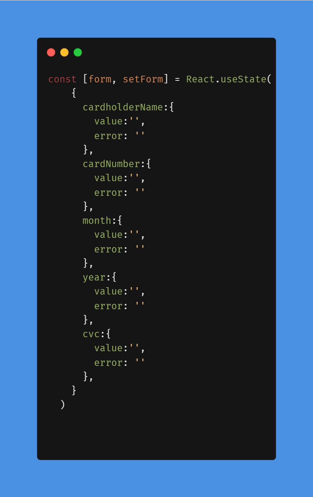
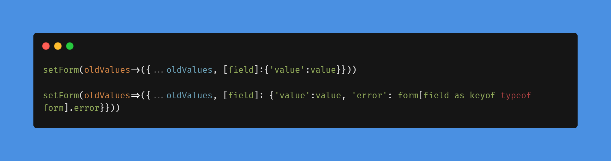

# Frontend Mentor - Interactive card details form solution

This is a solution to the [Interactive card details form challenge on Frontend Mentor](https://www.frontendmentor.io/challenges/interactive-card-details-form-XpS8cKZDWw). Frontend Mentor challenges help you improve your coding skills by building realistic projects. 

## Table of contents

- [Overview](#overview)
  - [The challenge](#the-challenge)
  - [Screenshot](#screenshot)
  - [Links](#links)
- [My process](#my-process)
  - [Built with](#built-with)
  - [What I learned](#what-i-learned)
  - [Useful resources](#useful-resources)
- [Author](#author)

## Overview

### The challenge

Users should be able to:

- Fill in the form and see the card details update in real-time
- Receive error messages when the form is submitted if:
  - Any input field is empty
  - The card number, expiry date, or CVC fields are in the wrong format
- View the optimal layout depending on their device's screen size
- See hover, active, and focus states for interactive elements on the page

### Screenshot

### Links

- Solution URL: [GitHub](https://github.com/Danielhu3/interactive-card2)
- Live Site URL: [Netlify](https://your-live-site-url.com)

## My process

### Built with

- Semantic HTML5 markup
- CSS custom properties
- Flexbox
- CSS Grid
- Mobile-first workflow
- [React](https://reactjs.org/) - JS library
- [Next.js](https://nextjs.org/) - React framework
- [Styled Components](https://styled-components.com/) - For styles

### What I learned

### Object field getting deleted on set values

- This is the state object that i was trying to update one value

<ul> 
<li>On example one, when i was trying to update the field 'value', the field 'error' was getting deleted </li>
<li>On example two, i get the error value himself and pass it again </li>
</ul>

### Setting credit card mask to input
<code> value = value.replace(/\s/g, '').replace(/(.{4})/g, '$1 ').trim() </code>
- First replace remove unexpecteds spaces
- second replace apply space between each 4 char
- trim removes space after the last 4 char group 

### Useful resources

- [Gradient on input border](https://stackoverflow.com/questions/33054514/how-to-apply-linear-gradient-to-input-border) - This helped me when i had trouble in put a linear-gradient color on input border

- [Reactive value from form](https://stackoverflow.com/questions/57086672/element-implicitly-has-an-any-type-because-expression-of-type-string-cant-b) - This helped me to put in the input a reactive value from the form object 

- [Credit card input mask](https://github.com/cosmoart/Interactive-card-details-form) - This helped me apply credit card mask to input 

## Author

- Frontend Mentor - [@Danielhu3](https://www.frontendmentor.io/profile/Danielhu3)

